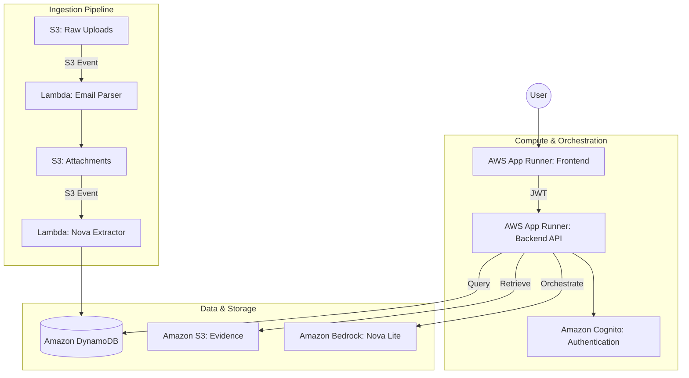

# FinX Invoice Intelligence — AI Chatbot

> **AWS Nova Hackathon Project** | Powered by [Amazon Nova Lite](https://aws.amazon.com/ai/generative-ai/nova/)

> [!NOTE]
> This is our beta version (MVP). We are actively adding more features to transition to a production-grade system and prepare for listing on the AWS Marketplace.

## 1. Project Summary & Purpose
**FinX** is an enterprise-grade **Invoice Intelligence Copilot** for accounts payable teams. It uses Amazon Nova Lite (via Bedrock) for explainable, evidence-first AI that can search invoices, detect fraud, retrieve email evidence, and manage investigation cases.

### Leveraging Amazon Nova Foundation Models
FinX leverages **Amazon Nova Lite** (via Amazon Bedrock) to provide:
- **Explainable AI (Evidence-First)**: Every claim is backed by specific evidence (invoice IDs, line items, email snippets).
- **Agentic Orchestration**: Nova Lite acts as an agent, using tools to search DynamoDB, retrieve S3 evidence, and manage fraud cases.
- **High Intelligence & Low Latency**: Seamless real-time chat interactions powered by AWS's latest foundation models.

---

## 2. Business Problem & Solution

### The Problem
Enterprises handle thousands of manual invoice validations, leading to:
1.  **High Manual Effort**: Humans cross-referencing data between emails and invoices.
2.  **Fraud Risks**: Duplicate or forged billing escaping detection.
3.  **Audit Gaps**: Difficulties in tracing the reasoning behind financial decisions.

### The FinX Solution
1.  **Rapid Ingestion**: Automatic parsing and structuring of invoices.
2.  **Fraud Intelligence**: Real-time scoring for suspicious documents.
3.  **Explainable Auditing**: A natural-language interface to the processing history (Audit Layer).
4.  **Enterprise Security**: Deep integration with AWS IAM, Cognito, and RBAC.

---

## 3. Architecture

### 3.1 Infrastructure Architecture (AWS)


### 3.2 Backend & Frontend Overview
- **Backend (FastAPI)**: Modular service architecture orchestrating Bedrock, DynamoDB, and S3.
- **Frontend (Next.js 15)**: A 3-pane Intelligence Cockpit for unified filtering, chat, and evidence viewing.

---

## 4. Quick Start

### Local Development (with Docker Compose)
```bash
# 1. Configure AWS credentials
aws configure  # or use IAM role / env vars

# 2. Copy backend env
cp backend/.env.example backend/.env

# 3. Start everything
docker compose up -d

# Frontend: http://localhost:3000
# Backend:  http://localhost:8000/docs (FastAPI Swagger)
```

### Frontend only (no backend)
```bash
cd frontend
npm install
npm run dev
# http://localhost:3000 (backend calls will show friendly error)
```

### Backend only
```bash
cd backend
pip install -r requirements.txt
cp .env.example .env  # set DEV_MODE=true
uvicorn app.main:app --reload --port 8000
```

---

## Project Structure

```
appsys-invi-iac-dev/
├── frontend/                   # Next.js 15 (TypeScript, Tailwind v4, Framer Motion)
│   ├── src/app/
│   │   ├── dashboard/          # 3-pane Intelligence Cockpit
│   │   ├── fraud-station/      # Fraud case management
│   │   └── api/chat/stream/    # Edge SSE proxy (adds JWT to backend calls)
│   └── src/components/
│       ├── chat/               # ChatPane, ChatBubble, citations
│       ├── filters/            # FilterPane (date, status, vendor, fraud score)
│       ├── evidence/           # EvidencePanel (email, attachments, RBAC)
│       └── layout/             # Navbar
│
├── backend/                    # Python FastAPI (AWS App Runner)
│   └── app/
│       ├── routers/            # /chat/stream, /invoices, /evidence, /fraud-cases
│       └── services/
│           ├── rbac.py         # Cognito JWT validation + ActorContext
│           ├── dynamodb.py     # SearchInvoices, GetInvoice, FraudCases
│           ├── s3.py           # Email evidence, MIME parser, signed URLs
│           └── bedrock.py      # Nova Lite orchestrator (6 tools, agentic loop)
│
├── .github/workflows/
│   ├── deploy.yml              # Terraform apply (main) / plan (PR)
│   ├── backend-deploy.yml      # ECR build + App Runner deploy
│   └── frontend-deploy.yml     # Next.js build + type check
│
├── docker-compose.yml          # Local dev: backend + frontend
│
└── appsys-invi-iac-modules/
    ├── chatbot_api/            # App Runner + ECR + IAM Terraform module
    ├── dynamodb/               # DynamoDB tables module
    ├── lambda_app/             # Existing Lambda functions
    └── sqs_queue/              # SQS + DLQ module
```

---

---

## Terraform: Enable Chatbot Features

```bash
cd appsys-invi-iac-dev

# Preview what will be created
terraform plan -var="enable_cognito=true" -var="enable_chatbot=true"

# Apply (provisions: Cognito User Pool, ECR repo, App Runner service)
terraform apply -var="enable_cognito=true" -var="enable_chatbot=true"

# Get outputs
terraform output chatbot_api_url     # → set as BACKEND_URL in frontend env
terraform output cognito_user_pool_id
terraform output ecr_repository_url  # → push Docker image here
```

---

## 5. Hackathon Build & Deployment Guide

This section provides the end-to-end steps to deploy FinX and populate it with data for evaluation.

### 5.1 Infrastructure Deployment (Terraform)
1. **Initialize Terraform**:
   ```bash
   terraform init -backend-config="bucket=YOUR_TF_STATE_BUCKET"
   ```
2. **Deploy Core Resources**:
   ```bash
   terraform apply \
     -var="enable_cognito=true" \
     -var="enable_chatbot=true" \
     -var="enable_chatbot_ui=true"
   ```
   *This provisions DynamoDB, S3, Cognito, ECR, and App Runner.*

### 5.2 Application Deployment
1. **Build & Push Backend**:
   ```bash
   cd backend
   aws ecr get-login-password --region us-east-1 | docker login --username AWS --password-stdin YOUR_ECR_URL
   docker build -t finx-chatbot-api .
   docker tag finx-chatbot-api:latest YOUR_ECR_URL:latest
   docker push YOUR_ECR_URL:latest
   ```
2. **Build & Push Frontend**:
   *Follow similar steps in the `frontend` directory using the `finx-chatbot-ui` ECR repository.*

---

## 6. Data Ingestion & Testing

To test the intelligence of the platform, you can ingest documents using two methods:

### Method A: Direct S3 Upload (Internal Ingestion)
1. Navigate to the **S3 Bucket** (from `terraform output`).
2. Upload a PDF or Image invoice to the `email-attachment/` prefix.
3. This triggers the **Nova Extractor Lambda** which processes the document using Amazon Nova Lite and stores it in DynamoDB.

### Method B: Email Ingestion (External Ingestion)
1. Send an email with an invoice attachment (PDF/PNG/JPG) to: `test@intake-dev.YOUR_DOMAIN` (default: `test@intake-dev`)
2. **SES** receives the email, stores it in S3, and triggers the **Email Parser Lambda**.
3. The parser extracts the attachment and passes it to the Nova Extractor for intelligent analysis.

---

## 7. Chatbot Verification

Once documents are ingested, interact with the **FinX Copilot**:

1. **Basic Search**: "Show me all invoices from Amazon processed today."
2. **Fraud Detection**: "Are there any suspicious invoices in the system?"
3. **Audit Query**: "Why was the invoice from Global Logistics rejected?"
4. **Evidence Retrieval**: "Show me the email evidence for invoice #INV-1002."

---

## 8. Deployment Status & Registry

### 1. Build & push the backend image
```bash
# Authenticate to ECR
aws ecr get-login-password --region us-east-1 \
  | docker login --username AWS --password-stdin $(terraform output -raw ecr_repository_url | cut -d/ -f1)

# Build and push
cd backend
docker build -t $(terraform -chdir=../appsys-invi-iac-dev output -raw ecr_repository_url):latest .
docker push $(terraform -chdir=../appsys-invi-iac-dev output -raw ecr_repository_url):latest
```

### 2. Trigger App Runner deployment
```bash
# Via AWS CLI
aws apprunner start-deployment \
  --service-arn $(aws apprunner list-services \
    --query "ServiceSummaryList[?ServiceName=='finx-chatbot-api'].ServiceArn" \
    --output text)

# Or push to main branch — GitHub Actions handles it automatically
```

---


---

## 9. GitHub Actions Variables

Set these in **Settings → Environments → dev → Variables**:

| Variable | Value | Description |
|---|---|---|
| `ENABLE_COGNITO` | `true` | Enable Cognito in Terraform apply |
| `ENABLE_CHATBOT` | `true` | Enable App Runner in Terraform apply |
| `CHATBOT_IMAGE_TAG` | `latest` | Docker image tag to deploy |
| `BACKEND_URL` (secret) | `https://xxx.us-east-1.awsapprunner.com` | Backend URL for frontend build |

---

## Security

- **RBAC**: Cognito JWT RS256 validated on every request. `tenantId` always from token.
- **Tenant isolation**: All DynamoDB queries scoped to `actorContext.tenantId`.
- **Email access**: `canViewEmails=false` → body scrubbed, no signed URLs.
- **Signed URL scope**: S3 key must start with `{tenantId}/` prefix.
- **Prompt injection**: Emails land in the user turn only; system prompt is immutable.
- **Local dev**: `DEV_MODE=true` in `backend/.env` bypasses Cognito (never in prod).

---

## Nova Lite Tool Loop

Nova Lite orchestrates 6 tools via Bedrock `ConverseStream` API:

| Tool | Description |
|---|---|
| `SearchInvoices` | Filter invoices by status, vendor, date, fraud score, amount |
| `GetInvoice` | Full invoice detail by ID |
| `ListForgedInvoices` | Fraud list sorted by score |
| `GetEmailEvidence` | Email sender, body, attachments (RBAC gated) |
| `GetSignedUrl` | Pre-signed S3 URL for attachment download |
| `CreateFraudCase` | Open an investigation case (APPROVER/ADMIN only) |

Temperature: `0.1` | Max turns: `6` | Max tokens: `4096`
